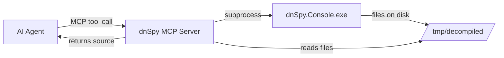
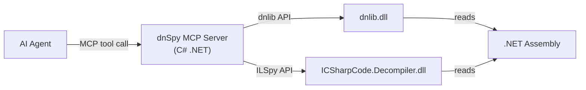
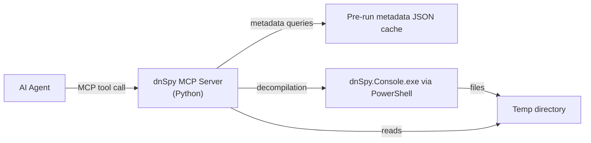

# dnSpy Reconnaissance Report — MCP Server Integration Assessment

> **Asset Location:** `E:\Thales\Thon\tools\dnSpy-net-win64`
> **Version:** 6.1.8 (self-contained .NET 5.0 win-x64)
> **Date:** 2026-03-10

---

## 1. What Is dnSpy

dnSpy is a **GPL-3.0 .NET assembly browser, decompiler, debugger, and editor**. Originally by de4dot, now maintained as [dnSpyEx](https://github.com/dnSpyEx/dnSpy). It can:

- **Decompile** .NET assemblies into C#, VB.NET, or raw IL
- **Debug** .NET Framework, .NET Core, and Mono processes (attach/launch)
- **Edit** IL instructions, metadata, and resources directly in assemblies
- **Analyze** type/method references, dependencies, and call graphs
- **Script** via embedded Roslyn C# Interactive REPL

---

## 2. Inventory — What We Have

```
dnSpy-net-win64/
├── dnSpy.exe              # 212 KB — WPF GUI application
├── dnSpy.Console.exe      # 143 KB — CLI decompiler (headless)
└── bin/                   # 405 files — self-contained .NET 5.0 runtime
    ├── dnlib.dll              # 1.1 MB — PE/metadata parser (core engine)
    ├── ICSharpCode.Decompiler.dll  # 522 KB — ILSpy decompiler core
    ├── dnSpy.Decompiler.*.dll      # Decompiler pipeline
    ├── dnSpy.Debugger.*.dll        # Debugger modules (CorDebug, Mono)
    ├── dnSpy.Analyzer.x.dll        # Analysis (find usages, etc.)
    ├── dnSpy.AsmEditor.x.dll       # Assembly editing/patching
    ├── dnSpy.BamlDecompiler.x.dll  # WPF BAML → XAML
    ├── dnSpy.Scripting.Roslyn.x.dll # C# scripting subsystem
    ├── Iced.dll                     # x86/x64 disassembler
    ├── Microsoft.CodeAnalysis.*.dll # Roslyn compiler platform
    ├── dnSpy.Contracts.*.dll        # Public API contracts + XML docs
    └── [.NET 5.0 runtime, WPF, native DLLs]
```

---

## 3. CLI Interface — [dnSpy.Console.exe](file:///E:/Thales/Thon/tools/dnSpy-net-win64/dnSpy.Console.exe)

Full-project decompiler via command line. All flags extracted from [source](https://github.com/dnSpyEx/dnSpy/blob/master/dnSpy/dnSpy.Console/Program.cs):

| Flag | Arg | Purpose |
|------|-----|---------|
| `-o`, `--output-dir` | `PATH` | Output directory for decompiled source |
| `-l`, `--lang` | `NAME\|GUID` | Decompiler language (C#, VB, IL) |
| `-r`, `--recursive` | — | Recursively find assemblies in paths |
| `-t`, `--type` | `NAME` | Decompile only the specified type |
| `--md` | `0x06XXXXXX` | Decompile a single metadata token |
| `--gac-file` | `"full name"` | Decompile from the GAC |
| `--asm-path` | `PATH[;PATH]` | Additional assembly search paths |
| `--user-gac` | `PATH` | Custom GAC directories |
| `--no-gac` | — | Don't search the GAC |
| `--no-stdlib` | — | Don't add mscorlib reference |
| `--no-sln` | — | Don't create .sln file |
| `--sln-name` | `NAME` | Custom solution filename |
| `--threads` | `N` | Parallel threads for decompilation |
| `--vs` | `2005–2022` | Target Visual Studio version |
| `--no-resources` | — | Skip unpacking resources |
| `--no-resx` | — | Skip .resx generation |
| `--no-baml` | — | Skip BAML → XAML decompilation |
| `--no-color` | — | Disable console coloring |
| `--spaces` | `N` | Indentation width (0–100) |
| `--project-guid` | `GUID` | Override project GUID |
| `--sdk-project` | — | Generate SDK-style project files |

> [!WARNING]
> [dnSpy.Console.exe](file:///E:/Thales/Thon/tools/dnSpy-net-win64/dnSpy.Console.exe) crashes in non-interactive shells (e.g., Antigravity's bash) with `System.IO.IOException: The handle is invalid` due to `Console.OutputEncoding = UTF8`. The MCP wrapper must pipe through `cmd /c` or PowerShell with a proper console handle, OR bypass it entirely using the library approach.

---

## 4. Underlying Libraries — The Real Power

### 4.1 [dnlib.dll](file:///E:/Thales/Thon/tools/dnSpy-net-win64/bin/dnlib.dll) — Assembly Metadata Engine
- **NuGet:** [dnlib](https://www.nuget.org/packages/dnlib/)
- **Capabilities:** Load/parse/write PE files, metadata tables, IL method bodies, resources, strong names, PDBs
- **Key advantage:** Handles heavily obfuscated assemblies that crash `Mono.Cecil`
- **API surface:** `ModuleDef`, `TypeDef`, `MethodDef`, `FieldDef`, `CustomAttribute`, `ImplMap`, metadata streams

### 4.2 [ICSharpCode.Decompiler.dll](file:///E:/Thales/Thon/tools/dnSpy-net-win64/bin/ICSharpCode.Decompiler.dll) — High-Level Decompiler
- **NuGet:** [ICSharpCode.Decompiler](https://www.nuget.org/packages/ICSharpCode.Decompiler/)
- **Capabilities:** Full C# decompilation from IL, syntax tree generation, whole-project export
- **API surface:** `CSharpDecompiler`, `DecompilerSettings`, `WholeProjectDecompiler`

### 4.3 [Iced.dll](file:///E:/Thales/Thon/tools/dnSpy-net-win64/bin/Iced.dll) — x86/x64 Disassembler
- **NuGet:** [Iced](https://www.nuget.org/packages/Iced/)
- **Capabilities:** Decode/format x86/x64 instructions (for native interop analysis)

---

## 5. MCP Integration Strategy — Three Approaches

### Strategy A: CLI Wrapper (Low-Complexity, Medium-Value)

Wrap [dnSpy.Console.exe](file:///E:/Thales/Thon/tools/dnSpy-net-win64/dnSpy.Console.exe) as a subprocess. The MCP server shells out, captures output.



**Tools exposed:**
| Tool | Description |
|------|-------------|
| `decompile_assembly` | Decompile entire assembly to C# project |
| `decompile_type` | Decompile a single type by name |
| `decompile_token` | Decompile a single method/type by metadata token |

**Pros:** Zero dependencies, uses the exact binary we have
**Cons:** Console handle crash requires workaround; cold-start latency; file I/O overhead; no metadata inspection

---

### Strategy B: dnlib + ICSharpCode Native Library (High-Complexity, Maximum Value) ⭐

Build the MCP server as a C# .NET project that directly references [dnlib.dll](file:///E:/Thales/Thon/tools/dnSpy-net-win64/bin/dnlib.dll) and [ICSharpCode.Decompiler.dll](file:///E:/Thales/Thon/tools/dnSpy-net-win64/bin/ICSharpCode.Decompiler.dll) from the `bin/` directory.



**Tools exposed:**
| Tool | Description |
|------|-------------|
| `load_assembly` | Load and cache a .NET assembly for analysis |
| `list_types` | List all types in a loaded assembly |
| `list_methods` | List methods of a type with signatures |
| `decompile_type` | Full C# source of a type |
| `decompile_method` | Full C# source of a single method |
| `get_references` | List assembly references and dependencies |
| `get_metadata` | PE headers, CLR version, entry point, attributes |
| `get_resources` | List embedded resources |
| `get_il` | Raw IL bytecode for a method |
| `search_strings` | Find string literals across the assembly |
| `get_custom_attributes` | List custom attributes on any member |
| `analyze_calls` | Find all callers/callees of a method |

**Pros:** In-process, fast, full metadata access, surgical precision, no temp files
**Cons:** Requires C# MCP server (not Python); must resolve assembly loading contexts carefully

---

### Strategy C: Python CLI Wrapper + Selective Library Use (Medium-Complexity, High-Value) 🎯

A **Python MCP server** that uses `subprocess` for decompilation AND `pythonnet` (or pre-extracted JSON metadata) for fast metadata queries.



**Pros:** Consistent with existing Python-based MCP servers; selective decompilation; caching layer
**Cons:** Two-phase (metadata cache + on-demand decompile); cold-start penalty

---

## 6. Recommended Approach

> [!IMPORTANT]
> **Strategy B** (native C# MCP server) is the doctrine-optimal choice for maximum capability density. However, **Strategy C** (Python wrapper) is the pragmatic choice for rapid deployment given existing MCP server patterns in the ecosystem are Python-based.

### Recommended Tool Surface (either strategy):

| Priority | Tool | Value |
|----------|------|-------|
| **P0** | `decompile_method(assembly, type, method)` | Surgical decompilation for code review |
| **P0** | `list_types(assembly)` | Assembly reconnaissance |
| **P0** | `decompile_type(assembly, type)` | Full type source code |
| **P1** | `get_metadata(assembly)` | PE/CLR version, entry point, architecture |
| **P1** | `search_strings(assembly, pattern)` | Find hardcoded strings, keys, URLs |
| **P1** | `list_methods(assembly, type)` | Enumerate attack surface |
| **P2** | `get_il(assembly, type, method)` | Raw IL for obfuscated code |
| **P2** | `get_resources(assembly)` | Embedded configs, certs, data |
| **P2** | `analyze_calls(assembly, method)` | Call graph traversal |

---

## 7. Operational Notes

| Factor | Detail |
|--------|--------|
| **Console crash** | [dnSpy.Console.exe](file:///E:/Thales/Thon/tools/dnSpy-net-win64/dnSpy.Console.exe) must run via `powershell -Command "& '.\dnSpy.Console.exe' ..."` to get a valid console handle |
| **Runtime** | Self-contained .NET 5.0 — no system .NET required |
| **License** | GPL-3.0 — the MCP server wrapping it is fine as a tool, not a redistributable product |
| **Disk footprint** | ~150 MB total (bin/ directory) |
| **Obfuscation handling** | dnlib excels where Mono.Cecil fails — critical for offensive security analysis |
| **Available XML docs** | 9 contract XML files provide full API documentation for programmatic integration |

---

## 8. Prior Art

No existing MCP servers for .NET decompilation were found in the ecosystem. This would be a **novel capability** — giving an AI agent the ability to programmatically read and analyze compiled .NET assemblies is a significant force multiplier for:

- **Offensive security:** Reverse engineering .NET malware, CTF challenges, thick clients
- **Software analysis:** Understanding closed-source dependencies, API discovery
- **Debugging support:** Decompiling production assemblies to trace bugs
- **Code auditing:** Finding vulnerabilities in compiled .NET applications
