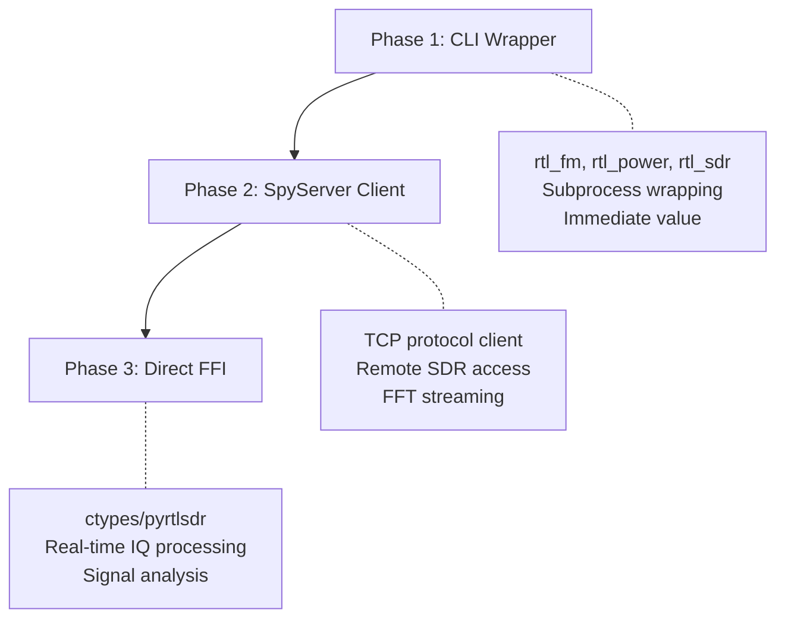

# SDR# (SDRSharp) Reconnaissance Report
## MCP Server Integration Feasibility Study

**Target:** [SDRSharp.dotnet8.exe](file:///E:/Thales/Thon/tools/sdrsharp/sdrsharp-x64/SDRSharp.dotnet8.exe) — Software Defined Radio receiver application  
**Location:** [SDRSharp.dotnet8.exe](file:///E:/Thales/Thon/tools/sdrsharp/sdrsharp-x64/SDRSharp.dotnet8.exe)  
**Date:** 2026-03-10

---

## Executive Summary

SDR# is a **GUI-only .NET 8 Windows application** with no CLI, no API, and no headless mode. It cannot be directly wrapped. However, the SDR ecosystem surrounding it offers **three viable integration strategies** for building an MCP server — each escalating in capability and complexity. The recommended approach is a **hybrid SpyServer client + rtl-sdr CLI wrapper**.

---

## 1. Target Analysis

### Binary Profile

| Property | Value |
|----------|-------|
| Format | PE32+ x86-64, GUI subsystem |
| Runtime | .NET 8 (also ships .NET 9 variant) |
| Size | 4.8 MB (single-file self-contained) |
| Plugin System | Yes — `Plugins/` directory, SDK available |
| Config | XML key-value ([SDRSharp.config](file:///E:/Thales/Thon/tools/sdrsharp/sdrsharp-x64/SDRSharp.config)) |
| Native Deps | [rtlsdr.dll](file:///E:/Thales/Thon/tools/sdrsharp/sdrsharp-x64/rtlsdr.dll), [airspy.dll](file:///E:/Thales/Thon/tools/sdrsharp/sdrsharp-x64/airspy.dll), [airspyhf.dll](file:///E:/Thales/Thon/tools/sdrsharp/sdrsharp-x64/airspyhf.dll), [portaudio.dll](file:///E:/Thales/Thon/tools/sdrsharp/sdrsharp-x64/portaudio.dll), [libusb-1.0.dll](file:///E:/Thales/Thon/tools/sdrsharp/sdrsharp-x64/libusb-1.0.dll) |

### Supported Hardware (from config)

- **RTL-SDR** — Budget USB dongle (~$30), 24-1766 MHz
- **Airspy** — Mid-range wideband receiver
- **Airspy HF+** — High-performance HF/VHF receiver
- **SpyServer** — Remote SDR streaming protocol (network client)
- **IQ File Player** — Replay recorded IQ data

### Demodulation Modes

`AM`, `NFM` (Narrowband FM), `WFM` (Wideband FM), `LSB`, `USB`, `DSB`, `CW`, `RAW`

### Key Config Parameters (Already Configured)

```xml
centerFrequency = 445500000  (445.5 MHz — UHF/walkie-talkie band)
vfo = 445500000
detectorType = 0              (AM)
sampleRate = 48000
iqSource = 5                  (RTL-SDR)
```

> [!NOTE]
> The user's current config is already tuned for UHF two-way radio monitoring at 445.5 MHz using an RTL-SDR dongle — aligning with the walkie-talkie monitoring use case from conversation `f7a10fcd`.

---

## 2. Integration Vectors

### ❌ Vector A: Direct SDR# Automation

**Verdict: Not viable.**

- No CLI arguments beyond basic launch
- No REST/TCP/gRPC API
- No headless mode
- GUI-only WinForms application
- Plugin SDK exists but requires compiling C# DLLs *loaded into the GUI process*
- UI automation (AutoHotkey) is fragile and not MCP-worthy

---

### ✅ Vector B: SpyServer Protocol Client (Recommended Primary)

**Verdict: Highly viable. The crown jewel.**

SpyServer is the official network streaming protocol for Airspy/SDR# devices. The protocol is **fully documented** in `spyserver_protocol.h` and can be implemented as a pure TCP client in Python.

#### Protocol Specification

| Element | Detail |
|---------|--------|
| Protocol Version | `2.0.1700` |
| Transport | Raw TCP sockets |
| Commands | `HELLO (0)`, `SET_SETTING (2)`, `PING (3)` |
| Stream Types | `STATUS (0)`, `IQ (1)`, `AF (2)`, `FFT (4)` |
| Streaming Modes | IQ-only, AF-only, FFT-only, FFT+IQ, FFT+AF |

#### Key Settings (SET_SETTING command)

| Setting | ID | Purpose |
|---------|----|---------|
| `STREAMING_MODE` | 0 | Select data stream type |
| `STREAMING_ENABLED` | 1 | Start/stop streaming |
| `GAIN` | 2 | Hardware RF gain |
| `IQ_FREQUENCY` | 101 | Center frequency |
| `IQ_DECIMATION` | 102 | Sample rate decimation |
| `FFT_FREQUENCY` | 201 | FFT center frequency |
| `FFT_DECIMATION` | 202 | FFT decimation |
| `FFT_DB_OFFSET` | 203 | Display offset |
| `FFT_DB_RANGE` | 204 | Dynamic range |
| `FFT_DISPLAY_PIXELS` | 205 | FFT resolution |

#### Architecture

```
┌─────────────────┐     TCP      ┌──────────────────┐
│  MCP Server     │◄────────────►│  SpyServer       │
│  (Python)       │  Protocol    │  (on RPi/remote)  │
│                 │              │                    │
│  • set_freq()   │              │  ┌──────────┐     │
│  • get_fft()    │              │  │ RTL-SDR  │     │
│  • record_iq()  │              │  │ Airspy   │     │
│  • scan_band()  │              │  └──────────┘     │
└─────────────────┘              └──────────────────┘
```

> [!IMPORTANT]
> SpyServer must be running on a machine with the SDR hardware. It can run on a Raspberry Pi, a Linode, or the same Windows machine. SDR# is NOT needed — SpyServer is a separate binary.

---

### ✅ Vector C: RTL-SDR CLI Tools Wrapper (Recommended Secondary)

**Verdict: Viable and simple. Good for local hardware.**

The `rtl-sdr` project provides command-line tools that talk directly to RTL-SDR hardware via `librtlsdr`. These are perfect for subprocess wrapping.

#### Available Tools

| Tool | Purpose | MCP Mapping |
|------|---------|-------------|
| `rtl_sdr` | Capture raw IQ samples to file | `capture_iq(freq, duration, file)` |
| `rtl_fm` | Demodulate FM/AM to audio | `demodulate(freq, mode, output)` |
| `rtl_power` | Wideband power scan → CSV | `scan_spectrum(start, stop, step)` |
| `rtl_test` | Device detection and tuner info | `detect_device()` |
| `rtl_tcp` | TCP IQ server (like SpyServer lite) | `start_iq_server(port)` |

#### Example Commands

```bash
# Scan UHF band for activity
rtl_power -f 440M:450M:12.5k -g 40 -i 10 -1 output.csv

# Demodulate NFM at 445.5 MHz
rtl_fm -M fm -f 445500000 -s 12500 -g 40 -l 10 | sox - -t wav output.wav

# Capture raw IQ for 10 seconds
rtl_sdr -f 445500000 -s 2400000 -n 24000000 -g 40 capture.bin
```

---

### ✅ Vector D: Direct librtlsdr FFI (Advanced)

**Verdict: Viable via ctypes/cffi. Maximum control.**

The [rtlsdr.dll](file:///E:/Thales/Thon/tools/sdrsharp/sdrsharp-x64/rtlsdr.dll) (337 KB) in the SDR# directory is the standard librtlsdr C library. Key exported functions:

| Function | Purpose |
|----------|---------|
| `rtlsdr_open()` | Open device handle |
| `rtlsdr_close()` | Close device |
| `rtlsdr_set_center_freq()` | Tune to frequency |
| `rtlsdr_set_sample_rate()` | Set bandwidth |
| `rtlsdr_set_tuner_gain()` | Set RF gain |
| `rtlsdr_read_sync()` | Read IQ samples (blocking) |
| `rtlsdr_read_async()` | Read IQ samples (callback) |
| `rtlsdr_get_tuner_gains()` | List available gain values |
| `rtlsdr_set_bias_tee()` | Enable/disable bias-T power |

There is also a Python wrapper library: [pyrtlsdr](https://pypi.org/project/pyrtlsdr/) that wraps all of these functions.

---

## 3. Recommended Strategy: Hybrid MCP Server

### Proposed Tool Surface

```python
# ═══════════════════════════════════════════════════════
# SDR MCP Server — Proposed Tools
# ═══════════════════════════════════════════════════════

# Hardware Management
sdr_detect_devices()              # List connected SDR hardware
sdr_get_device_info(device_id)    # Tuner type, serial, gains

# Tuning & Reception
sdr_set_frequency(freq_hz)        # Tune to frequency
sdr_set_mode(mode)                # AM, NFM, WFM, USB, LSB, CW
sdr_set_gain(gain_db)             # Set RF gain (or AGC)
sdr_set_sample_rate(rate)         # Set bandwidth

# Data Capture
sdr_capture_iq(freq, duration)    # Capture raw IQ → file
sdr_demodulate(freq, mode, dur)   # Demod → WAV audio file
sdr_get_spectrum(freq, span)      # FFT snapshot → JSON array

# Scanning
sdr_scan_band(start, stop, step)  # Power scan → CSV/JSON
sdr_find_signals(start, stop)     # Detect active frequencies

# SpyServer Integration
spy_connect(host, port)           # Connect to SpyServer
spy_set_frequency(freq)           # Remote tune
spy_get_fft()                     # Get FFT data
spy_stream_iq(duration)           # Stream IQ data

# Band Plan & Reference
sdr_lookup_band(freq)             # What band/service is this?
sdr_get_band_plan()               # Full band plan database
```

### Implementation Priority



### Phase 1: CLI Wrapper (1-2 hours)
- Wrap `rtl_power`, `rtl_fm`, `rtl_sdr`, `rtl_test`
- Parse CSV/binary output into structured JSON
- Immediate operational capability

### Phase 2: SpyServer Client (4-6 hours)
- Implement SpyServer protocol in Python (TCP client)
- Enable remote SDR access from any machine
- Real-time FFT data for spectrum awareness

### Phase 3: Direct FFI (2-3 hours)
- ctypes bindings to [rtlsdr.dll](file:///E:/Thales/Thon/tools/sdrsharp/sdrsharp-x64/rtlsdr.dll) or use `pyrtlsdr`
- Async IQ streaming with callback
- Foundation for signal analysis (squelch, scanner logic)

---

## 4. Dependencies & Prerequisites

| Dependency | Status | Notes |
|------------|--------|-------|
| RTL-SDR dongle | ✅ Present | User has hardware (from conv `f7a10fcd`) |
| [rtlsdr.dll](file:///E:/Thales/Thon/tools/sdrsharp/sdrsharp-x64/rtlsdr.dll) | ✅ Present | 337 KB in SDR# directory |
| [libusb-1.0.dll](file:///E:/Thales/Thon/tools/sdrsharp/sdrsharp-x64/libusb-1.0.dll) | ✅ Present | USB access layer |
| RTL-SDR drivers (WinUSB) | ⚠️ Needs verification | Zadig driver install may still be needed |
| `rtl_fm` / `rtl_power` | ❌ Not installed | Need rtl-sdr-blog tools package |
| `pyrtlsdr` | ❌ Not installed | `pip install pyrtlsdr` |
| SpyServer | ❌ Not running | Separate binary, available from Airspy |

---

## 5. Novelty Assessment

| Axis | Rating | Notes |
|------|--------|-------|
| Existing MCP SDR servers | **None found** | This would be a first-of-kind |
| Difficulty | **Medium** | Protocol is documented, CLI tools exist |
| Operational value | **High** | Walkie-talkie monitoring, spectrum awareness |
| Ecosystem fit | **Strong** | Complements Flipper Zero MCP (Sub-GHz) |

> [!TIP]
> The SDR MCP server + Flipper Zero MCP creates a **full-spectrum RF awareness platform**: Flipper handles Sub-GHz (garage doors, keyfobs, 315/433 MHz), while SDR covers VHF/UHF (walkie-talkies, FM radio, aircraft, marine, amateur radio).

---

## 6. Files of Interest

| File | Purpose | Path |
|------|---------|------|
| [SDRSharp.config](file:///E:/Thales/Thon/tools/sdrsharp/sdrsharp-x64/SDRSharp.config) | All tuning parameters | [SDRSharp.config](file:///E:/Thales/Thon/tools/sdrsharp/sdrsharp-x64/SDRSharp.config) |
| [BandPlan.xml](file:///E:/Thales/Thon/tools/sdrsharp/sdrsharp-x64/BandPlan.xml) | Frequency band database | [BandPlan.xml](file:///E:/Thales/Thon/tools/sdrsharp/sdrsharp-x64/BandPlan.xml) |
| [rtlsdr.dll](file:///E:/Thales/Thon/tools/sdrsharp/sdrsharp-x64/rtlsdr.dll) | librtlsdr C library | [rtlsdr.dll](file:///E:/Thales/Thon/tools/sdrsharp/sdrsharp-x64/rtlsdr.dll) |
| [install-rtlsdr.bat](file:///E:/Thales/Thon/tools/sdrsharp/sdrsharp-x64/install-rtlsdr.bat) | Driver install script | [install-rtlsdr.bat](file:///E:/Thales/Thon/tools/sdrsharp/sdrsharp-x64/install-rtlsdr.bat) |
| [changelog.txt](file:///E:/Thales/Thon/tools/sdrsharp/sdrsharp-x64/changelog.txt) | 12,257 lines of dev history | [changelog.txt](file:///E:/Thales/Thon/tools/sdrsharp/sdrsharp-x64/changelog.txt) |
